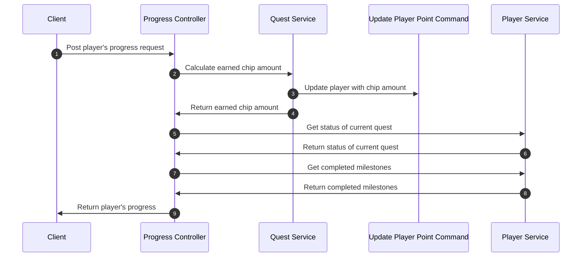

# questing-engine

This is my coding challenge to design a questing engine to record the progress of player and return a player status

## How to run
To run this project, make sure you have MongoDb in local cause I use Mongo to store data. You can get the latest version of MongoDb in [here](https://www.mongodb.com/try/download/community).
I have seeding data that automatically run in the first time you run application, so you don't need to manipulate data. To re-trigger seeding data, please drop your database in MongoDb and application will seed data again.
Another thing is you need to have Visual Studio 2019 to open project, start solution with pressing F5 button and browser will show Swagger.
## Test application
Because the application seeds data automatically, in case you want to get some data for testing, please open MongoDb Compass or any MongoDb clients to look at the database. Connection string is stored in appsettings.json.
## Sequence Diagram

**Note: Maybe you will need to install mermaid extension to view sequence diagram**